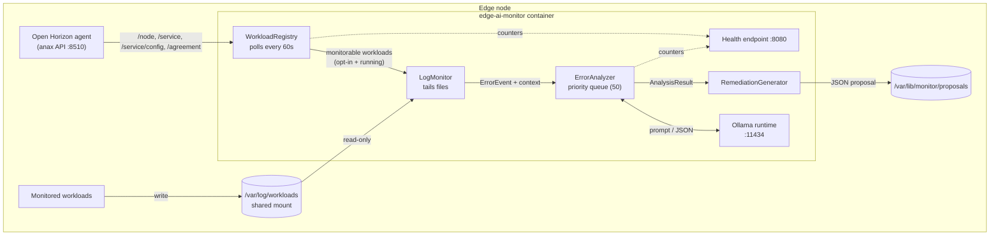

# Architecture

## Component overview



The monitor only ever **reads** from anax and from workload logs. It never
mutates node state and never modifies a monitored workload.

## Data flow

```mermaid
sequenceDiagram
    participant A as anax API
    participant R as WorkloadRegistry
    participant L as LogMonitor
    participant Q as ErrorAnalyzer
    participant M as Ollama
    participant P as RemediationGenerator

    loop every 60s
        R->>A: GET /service, /service/config, /agreement
        A-->>R: definitions + configs + active agreements
        R->>R: union sources, resolve state
        R->>L: watch opted-in running workloads
    end

    loop every 1s
        L->>L: read new lines, match patterns
        Note over L: on match, collect 50 lines<br/>before and after
        L->>Q: submit(ErrorEvent)
    end

    Note over Q: identical errors aggregate;<br/>cache hits skip inference
    Q->>M: analysis prompt + workload metadata
    M-->>Q: JSON analysis
    Q->>P: AnalysisResult
    P->>P: build proposal, flag for review
    P-->>P: write/update <workload>/<problem-key>.json
```

## Threading model

Four independent loops, so a slow LLM never stalls log reading:

| Thread | Cadence | Responsibility |
|---|---|---|
| `workload-discovery` | 60 s | Poll anax, update the registry, attach/detach log watches |
| `log-monitor` | 1 s (watchdog-nudged) | Tail files, match patterns, enqueue errors |
| `error-analyzer` | queue-driven | Run inference, emit results |
| `health-server` | request-driven | Serve `/health` and `/status` |

`LogMonitor.on_error` only enqueues — it never blocks on inference. Back-pressure
is handled by shedding the lowest-severity queued work, never by slowing down
log reading.

## Key design points

**Discovery unions three sources.** `/service/config` lists only services the
operator supplied user input for and is empty on a policy-registered node.
`/agreement` establishes what is *running*; `/service` supplies each workload's
deployment string, which carries the `MONITORING_*` opt-in variables. No single
source sees every workload.

**Monitoring requires three conditions:** `MONITORING_ENABLED=true`, an active
agreement, and at least one log path. A workload known only through an agreement
has no deployment string to carry the opt-in, so it is never monitored.

**Errors wait briefly for trailing context.** An error on the last line of a read
batch is held until the next read confirms no more context is arriving — the
spec's 50-lines-after window, bounded by what is actually available.

**Recurring errors aggregate.** Signatures normalise digits, so timestamps, PIDs
and retry counters do not make every occurrence look unique. The same error 3+
times in 5 minutes becomes one analysis with an occurrence count.

**Analyses are cached** for 15 minutes by signature, so a flapping workload does
not re-run inference for an error already explained.

## Resource ceilings

| Limit | Default | Behaviour at the limit |
|---|---|---|
| Log buffer | 100 MB | Drop oldest buffered entries, warn |
| Log file size | 1 GB | Tail only the most recent 100 MB, warn |
| Analysis queue | 50 | Shed lowest-severity pending requests, warn |
| Inference timeout | 30 s | Cancel the request, log a timeout |
| Container memory | 4 GB | Enforced by the service definition |

## Failure behaviour

Every external dependency is treated as optional at startup and recoverable at
runtime:

- **anax unreachable** — discovery logs the error and retries next interval.
- **Ollama down** — discovery and log monitoring continue; analyses fail.
- **Log path missing** — that path is skipped; other paths keep working.
- **Proposal storage unwritable** — the proposal is printed to stdout rather
  than lost.
- **Health port taken** — the service runs without the health endpoint.

Startup problems are reported in `startup_errors` on the health endpoint rather
than aborting the service, because both anax and Ollama may come up after the
monitor does.
